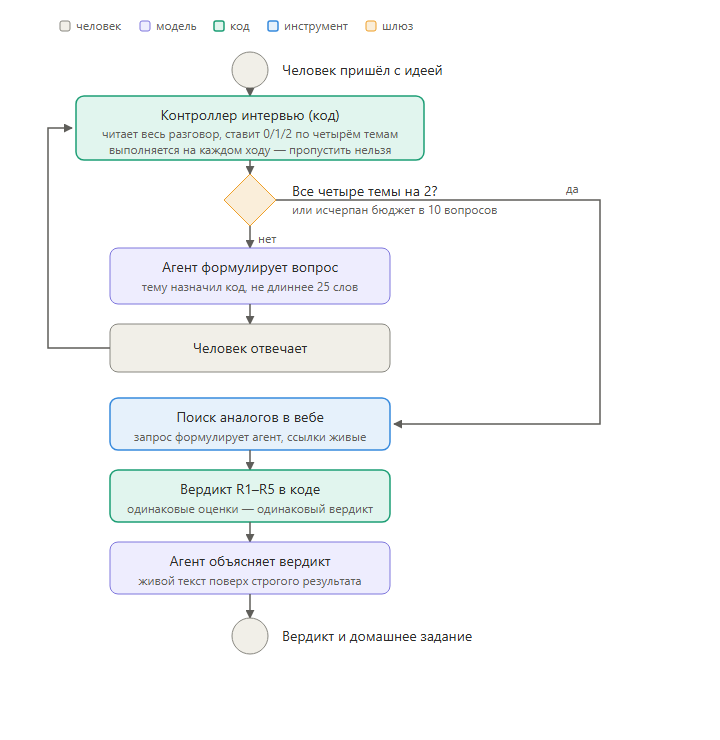

# ai-accelerator-idea-validation-demo

An interviewer assistant for the first-pass screening of startup accelerator
applications, built in [Langflow](https://langflow.org). In 5–10 questions it
finds out whether there are facts behind the idea, checks the market, and issues
a verdict computed by deterministic code, together with targeted homework.

A port of the original Python project `ai-accel` into a visual flow. The current
version is **v3-update-1**: code drives the interview logic, the model is
responsible for language only.

*[Русская версия — [`README.md`](README.md)]*

<p align="center">
  
</p>

<p align="center"><sub>Interview flow (diagram in Russian): the controller runs on every turn, the R1–R5 verdict at the end</sub></p>

---

## What's inside

| Folder | Contents |
|---|---|
| `components/` | Source code of the custom Langflow components, one file each |
| `docs/` | Architecture, findings, trade-offs, demo talking points (in Russian) |
| `presentation/` | Presentation and the BPMN flow diagram |

## Architecture

```
Chat Input ─┬──────────────────────────────────────► Agent (input_value)
            │
            └──► Interview Controller ──► Agent (system_prompt)

Yandex Chat Model ────────────────────► Agent (model)
Verdict R1-R5 (tool) ─────────────────► Agent (tools)
Yandex Web Search (tool) ─────────────► Agent (tools)

Agent ────────────────────────────────► Chat Output
```

Seven nodes, seven edges. Flow diagram — `presentation/bpmn-agentic-flow-ru.png`.

### The principle: the model speaks, the code decides

| Component | Role | Who decides |
|---|---|---|
| **Interview Controller** | Reads the conversation, assigns scores, keeps counters and the budget, picks the next topic, assembles the system prompt for the agent | Code |
| **Agent** | Phrases the question on the assigned topic, retells the verdict | Model |
| **Verdict R1-R5** | Rules R1–R5, reads the scores from state itself | Code |
| **Yandex Web Search** | Finds analogues, returns live links | AI Studio tool |

The controller sits in the graph between the human's message and the agent, so it
runs **on every turn, unconditionally**. In the previous version it was a tool the
agent was "supposed" to call — in practice the model called it on one turn out of five.

An important caveat for a technical audience: **the scores themselves are assigned
by a model**, in a separate call with `temperature=0` and a strict JSON schema
(only 0/1/2 per topic). The code owns everything around that judgement: which
topics are still to be scored, monotonic merging (a 2 never falls back), attempt
counters, the question budget, and the verdict rules.

## Methodology

The four topics lean on well-known frameworks: Customer Development (audience),
The Mom Test (behaviour), Jobs to Be Done (alternatives), Lean Startup (validation).
Each is scored 0/1/2; only an application with all four at 2 passes.

Details — [`docs/DEMO-TEZISY-RU.md`](docs/DEMO-TEZISY-RU.md) (Russian).

## Measurements

All runs are synthetic: there were no real applications, no comparison against
expert judgement, and no labelled dataset.

| Metric | Value |
|---|---|
| Latency per turn | 6–20 s |
| Interview length | 4–5 questions against a budget of 10 |
| Cost per application | ≈ ₽12 (ceiling ≈ ₽17) |
| Controller invocations | 5 out of 5 (was 1 out of 5) |

## Models

| Where | Model | Why |
|---|---|---|
| Agent | `deepseek-v4-flash` | Of the seven models compared, the only one that held the two-attempt rule and did not hint at the audience criteria |
| Scoring | `gpt-oss-120b` | Internal JSON the user never sees; three times faster (6.9 s vs 19.6 s) |
| Web search | `yandexgpt` | Works, left untouched |

`yandexgpt-5-pro` does not support tool calling and is unusable in principle.

## How to run

1. Bring up Langflow (tested on a Python 3.14 build in Docker).
2. Assemble the flow per the diagram above, pasting in the component code from `components/`.
3. Put your own Yandex API Key and Folder ID into `Yandex Chat Model`,
   `Yandex Web Search` and `Interview Controller`.

## Known limitations

- **The scores are assigned by a model** — it may grade the same transcript
  slightly differently. The verdict rules are deterministic, but their inputs are not.
- **No labelled dataset** — scoring consistency has not been measured. That is a
  precondition for production use.
- **90 s timeout on the scoring call.** If the API request hangs, a turn can take
  ~96 s instead of the usual 6–20 s. Observed once during a demo; the fix is to
  lower the timeout to ~20 s, but it has not been applied.

## There is no flow export

The repository contains no ready-made JSON to import into Langflow: exporting the
current v3-update-1 did not work out, as the Docker instance of Langflow was
unavailable at the time of publication. The outdated export of the first agentic
version was removed so as not to mislead. The current code of all components lives
in `components/` and fully describes the current version — the flow is assembled
from the diagram above.

## Security

There are no keys in the repository, neither in the component code nor in the docs.

## Documentation

- [`docs/DEMO-TEZISY-RU.md`](docs/DEMO-TEZISY-RU.md) — demo talking points
- [`docs/V3-UPDATE-1-RU.md`](docs/V3-UPDATE-1-RU.md) — architecture of the current version, bugs fixed
- [`docs/AGENTIC-WORKFLOW-RU.md`](docs/AGENTIC-WORKFLOW-RU.md) — the first agentic version
- [`docs/WORKFLOW.md`](docs/WORKFLOW.md) — debugging history of the original 16-node flow

All documentation is in Russian.

## License

MIT — see [`LICENSE`](LICENSE).
